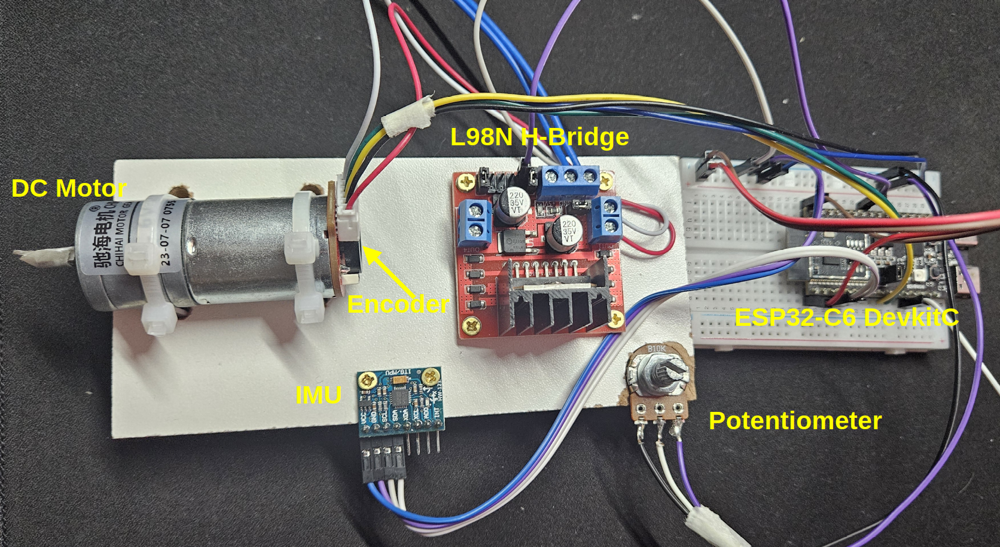

# NuttX ESP32-C6 Motor Control and Sensing

This repository contains the source code for the article series "NuttX for Motor Control and Sensing" published on [Espressif's Developer Portal](https://developer.espressif.com/blog/).

## Overview

Demonstrates how to use multiple ESP32-C6 peripherals with NuttX RTOS:
- Motor Control PWM (MCPWM) for DC motor speed control
- Quadrature encoder for speed measurement
- ADC for potentiometer position reading
- IMU via I2C for vibration analysis (coming soon)
- WiFi connectivity for data streaming (coming soon)

## Hardware Requirements

- ESP32C6-DevkitC
- CHR-GM25-370 6V DC Motor with integrated gearbox and quadrature encoder
- L298N H-Bridge motor driver module
- 10kΩ linear potentiometer
- GY521 IMU module (MPU6050)



## GPIO Connections

- GPIO 20: MCPWM output to H-Bridge
- GPIO 3:  ADC input from potentiometer
- GPIO 10: Quadrature encoder channel A
- GPIO 11: Quadrature encoder channel B

## Building

This repository is designed to be used as an external application for NuttX. To build:

1. Clone this repository
2. Link it to your NuttX apps directory:
   ```bash
   ln -s <path-to-this-repo>/apps/ $NUTTX_PATH/apps/external
   ```
3. Configure NuttX:
   ```bash
   # Load base configuration
   ./tools/configure.sh esp32c6-devkitc:nsh
   
   # Merge with provided defconfig
   kconfig-merge -m .config ../apps/external/motor_sensing/config/defconfig
   make olddefconfig
   ```
4. Build and flash:
   ```bash
   make
   make flash ESPTOOL_BINDIR=./ ESPTOOL_PORT=/dev/ttyUSB0
   ```

## Usage

After flashing, run the application from NSH:
```bash
nsh> msense
```

The application will display:
- Command speed (from potentiometer)
- Actual motor speed in RPM (from encoder)
- Sample time and encoder configuration


## License

This project is licensed under the Apache License, Version 2.0 - see the [LICENSE](LICENSE) file for details.
